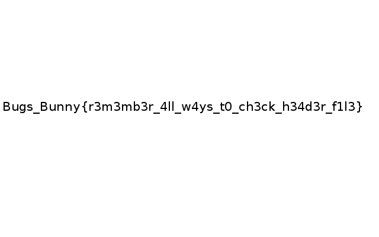

# Lost data (For 50)
We have to find the flag inside a file.

## Challenge description
```text
what's going on here ? i didn't find anything important here , can you help me ? 
[Link to file omitted]
```
And the following file: [file.zip](file.zip)

## Solution
Running `binwalk` on the file shows the following:
```bash
$ binwalk file

DECIMAL       HEXADECIMAL     DESCRIPTION
--------------------------------------------------------------------------------
54            0x36            ARJ archive data, header size: 94, version 11, minimum version to extract: 1, slash-switched, compression method: stored, file type: binary, original file date: 2017-06-25 21:16:44, compressed file size: 2092100, uncompressed file size: 2092100, os: Unix
158           0x9E            JPEG image data, EXIF standard
170           0xAA            TIFF image data, little-endian offset of first image directory: 8
428           0x1AC           Unix path: /www.w3.org/1999/02/22-rdf-syntax-ns#"> <rdf:Description rdf:about="" xmlns:xmp="http://ns.adobe.com/xap/1.0/" xmlns:xmpMM="http
2092258       0x1FECE2        ARJ archive data, header size: 56, version 11, minimum version to extract: 1, slash-switched, compression method: compressed most, file type: binary, original file date: 2017-07-22 22:42:55, compressed file size: 5125, uncompressed file size: 6618, os: Unix
```

Let's try to extract everything:
```bash
binwalk --dd=".*" file
```
Extracts the following files:
```bash
$ file _file.extracted/*

_file.extracted/1AC:    data
_file.extracted/1FECE2: ARJ archive data, v11, slash-switched, original name: , os: Unix
_file.extracted/36:     ARJ archive data, v11, slash-switched, original name: , os: Unix
_file.extracted/9E:     JPEG image data, Exif standard: [TIFF image data, little-endian, direntries=0], baseline, precision 8, 2880x1800, frames 3
_file.extracted/AA:     TIFF image data, little-endian, direntries=0
```

The `.JPEG` is the following:


Since there is no flag on first sight, let's try the `ARJ` archives. Both `1FECE2` and `36` have a bad header exception:
```bash
$ cp 1FECE2 1FECE2.arj
$ arj x 1FECE2 -jr

ARJ32 v 3.10, Copyright (c) 1998-2004, ARJ Software Russia. [03 Jun 2016]

Processing archive: 1FECE2.arj
Archive created: 2017-07-23 00:42:55, modified: 1970-01-01 02:25:25

Error (2): No such file or directory

Can't read file or unexpected end of file
```

There is an option for `arj` to fix that: 
> Recover files from a damaged archive:
> arj x archive -jr
> -- <cite>https://www.systutorials.com/docs/linux/man/1-arj/</cite>

But only the `36` can be fixed:
```bash
$ arj x 36 -jr

ARJ32 v 3.10, Copyright (c) 1998-2004, ARJ Software Russia. [03 Jun 2016]

Processing archive: 36.arj
Archive created: 2017-06-25 23:16:44, modified: 1970-01-25 06:08:20
Extracting flag.png                    OK        
     1 file(s)

```

Which gives us the flag:

