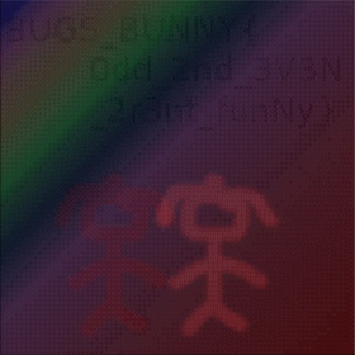
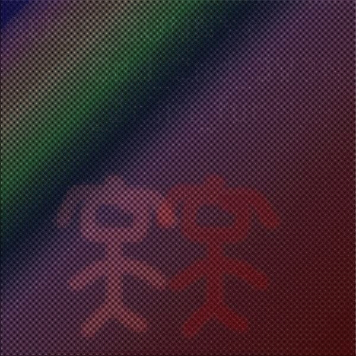

# odd & even 2 (Stego 100)
Author: MH

In this challenge we had to separate the even from the odd pixels
## Challenge description
```text
odd and even are two friends since ever.
Can you detach them.
Be the devil and do it.

flag : BUGS_BUNNY{}
```

Image:


## Solution
After I tried a few other approaches I finally went through all pixels and separated the even pixels from the odd ones. When you imagine a grid with rows and columns, if `row + column` is even I put it in one image and vice versa. I used the following script:
```python
#!/usr/bin/python3

from PIL import Image
img = Image.open("even_odd.jpg")
pixels = img.load()
size = img.size

evenImage = Image.new("RGB", img.size)
evenPixels = evenImage.load()

oddImage = Image.new("RGB", img.size)
oddPixels = oddImage.load()

for i in range(size[0]):
    for j in range(size[1]):
        if (i + j)%2 == 0:
            evenPixels[i, j] = pixels[i,j]
        else:
            oddPixels[i, j] = pixels[i, j]

evenImage.save("even.jpg", "JPEG")
oddImage.save("odd.jpg", "JPEG")
```

That produced the following images:




The flag is not so good readable, but you can guess it:
```text
BUGS_BUNNY{Odd_2nd_3V3N_2r3nt_funNy}
```
