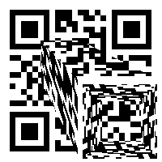

# Fix Me (Stego 130)
Author: MH

In this challenge we have to fix a QR code.

## Challenge description
```text
Try fix me

flag : Bugs_Bunny{flag}
```

We get a messed up QR-code:


And 50 parts like the following:


## Solution
The QR code parts have strange names like `(50,50,150).png` and `(52,52,180).png`. After some time I realised that the last number is the rotation of the QR code parts (in degrees). The first and second numbers are the coordinates of the pixels. I used the following script:
```python
#!/usr/bin/python3

from PIL import Image
import os
import re

qr = Image.open("res.png")

# Correct the order of the images (last number is the rotation)
for name in os.listdir("./qrcode"):
    nrInName = re.findall(r'\d+', name)
    img = Image.open("./qrcode/" + name)

    # Rotate the qr code part
    imgRotated = img.rotate(-int(nrInName[2]))

    # Add that to the qr code image
    qr.paste(imgRotated, (int(nrInName[0]), int(nrInName[1])))

qr.save("res_fixed.png")
```
Which produced this QR code:


Although the QR code is not perfect, it is scannable and produces the following flag:
```text Bugs_Bunny{QrCod2_Look_50_Co0l} ```
