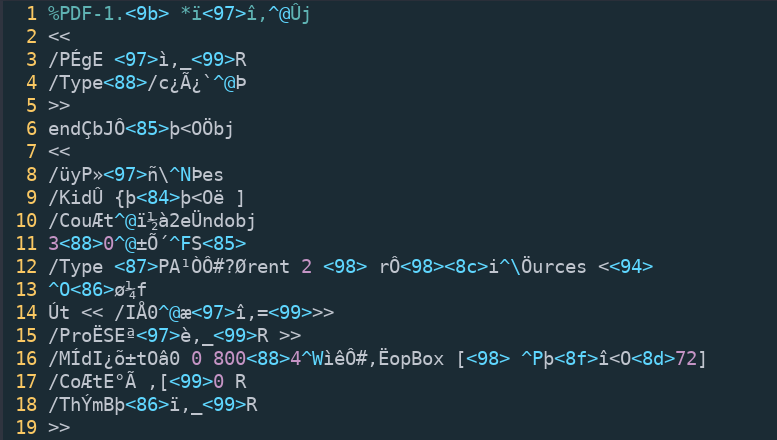

# Stack Overflow (Crypto 100)
Author: afs

#### Challenge description:
```
I had some issues implementing strong encryption, luckily I was able to find a nice example on stackoverflow that showed me how to do it.
```

We get a link to a [Stack Overflow question](https://stackoverflow.com/questions/3154998/pycrypto-problem-using-aesctr), a file called `flag.pdf.enc` and the following Python script:

```python
import os, sys
from Crypto.Cipher import AES

fn = sys.argv[1]
data = open(fn,'rb').read()

# Secure CTR mode encryption using random key and random IV, taken from
# http://stackoverflow.com/questions/3154998/pycrypto-problem-using-aesctr
secret = os.urandom(16)
crypto = AES.new(os.urandom(32), AES.MODE_CTR, counter=lambda: secret) 

encrypted = crypto.encrypt(data)
open(fn+'.enc','wb').write(encrypted)
```

#### Solution:

The accepted answer on Stack Overflow mentions that the so-called counter returning the same value at each call isn't going to be secure. In the Python script the counter always returns `secret` for each call.

Let's now recall how a block cipher with counter mode works:


(Source: [Wikipedia](https://en.wikipedia.org/wiki/Block_cipher_mode_of_operation#CTR))

The plaintext is encrypted blockwise by XORing it with some value that is generated from the key and a counter. Commonly the counter is implemented as a nonce concatenated with an actual increment-by-one counter. 

The problem with using the same counter for each block is that the block cipher encryption will output the same value for each block. Let's call that value Y. Each plaintext block will then be XORed with this Y.

Since the encrypted file is called `flag.pdf.enc` we can assume that the encrypted file is a PDF file. According to the [PDF Reference](https://www.adobe.com/content/dam/Adobe/en/devnet/acrobat/pdfs/pdf_reference_1-7.pdf) the first line of a PDF file is a header identifying the version of the PDF specification. So we can assume that it starts with `%PDF-1.X\n`. We cannot be sure about the exact version of the PDF - therefore the X.

Looking at the first block we can already infer half the bytes of Y by XORing the given ciphertext bytes with the assumed plaintext bytes:

|                 | 0    | 1    | 2    | 3    | 4    | 5    | 6    | 7    | 8    | 9    | 10   | 11   | 12   | 13   | 14   | 15   |
| --------------- |:----:|:----:|:----:|:----:|:----:|:----:|:----:|:----:|:----:|:----:|:----:|:----:|:----:|:----:|:----:|:----:|
| Plaintext       |  %   | P    | D    | F    | -    | 1    | .    | ?    | \n   | ?    | ?    | ?    | ?    | ?    | ?    | ?    |
| Plaintext (hex) | 0x25 | 0x50 | 0x44 | 0x46 | 0x2d | 0x31 | 0x2e | ?    | 0x0a | ?    | ?    | ?    | ?    | ?    | ?    | ?    |
| Ciphertext      | 0xd6 | 0xea | 0xb9 | 0x75 | 0x30 | 0x19 | 0x6a | 0x9b | 0x05 | 0x2a | 0xef | 0x97 | 0xee | 0x2c | 0x00 | 0xdb |
| Y               | 0xf3 | 0xba | 0xfd | 0x33 | 0x1d | 0x28 | 0x44 | ?    | 0x25 | ?    | ?    | ?    | ?    | ?    | ?    | ?    |
{:.mbtablestyle}

We fill the missing values of Y with `0x00` and decrypt `flag.pdf.enc` by XORing it blockwise with Y. The result already looks promising:



In line 10 we can spot `/CouÆt` which (if we look at the PDF reference) probably should be `/Count`. Thus we can infer one more byte of Y by XORing `Æ` (0xc6) with `n` (0x6e). 

In line 12 we spot `urces` which probably should be `/Resources`. Like this we can infer even more bytes of Y.

We repeat these steps (decrypting the `flag.pdf.enc` with a partially known Y and then looking at the result in order to infer more bytes of Y) until we fully know Y and we get the following PDF file:


Et voilà, there's the flag: **FLAG{15AD69452103C5DF1CF61E9D98893492}**
