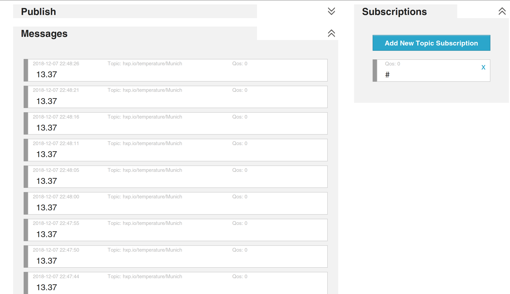
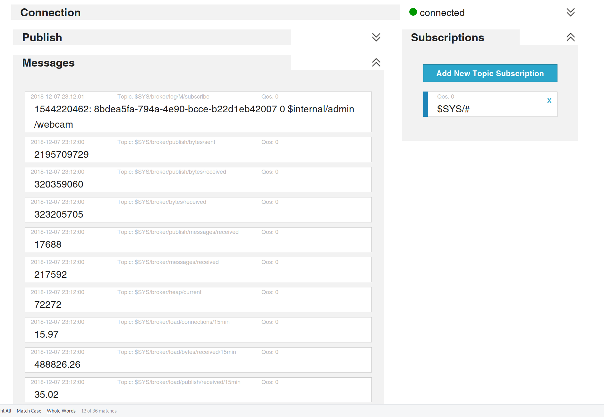
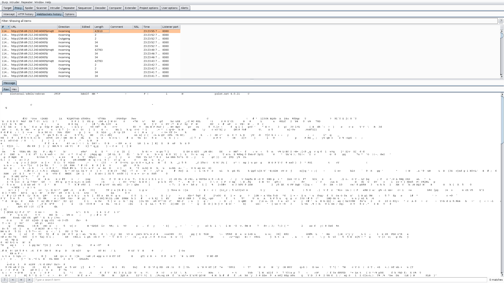
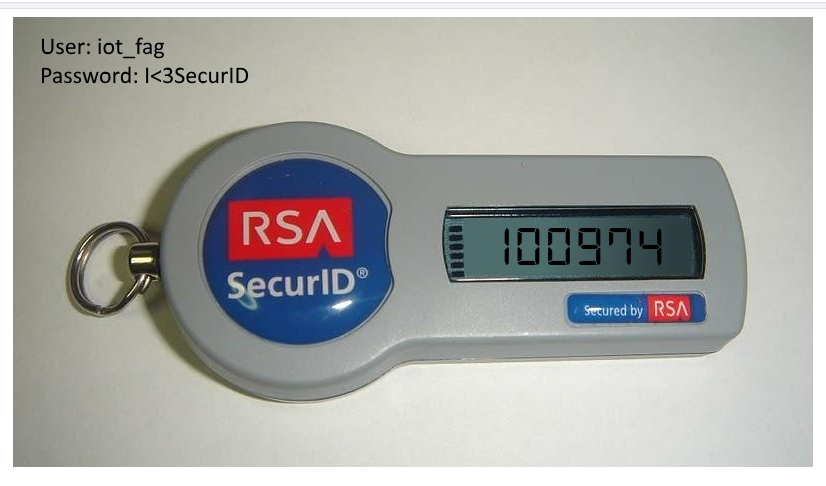
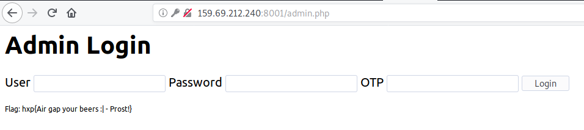

# time for h4x0rpsch0rr? (web 101)
## Description
```
Finally a use case for those internet tingies!
Connection:

http://159.69.212.240:8001/

```
## Information
This is a basic challenge about [MQTT](http://mqtt.org/).
>MQTT is a machine-to-machine (M2M)/"Internet of Things" connectivity protocol. It was designed as an extremely lightweight publish/subscribe messaging transport. 
>The protocol uses a publish/subscribe architecture in contrast to HTTP with its request/response paradigm. Publish/Subscribe is event-driven and enables messages to be pushed to clients. The central communication point is the MQTT broker, it is in charge of dispatching all messages between the senders and the rightful receivers. Each client that publishes a message to the broker, includes a topic into the message. The topic is the routing information for the broker. Each client that wants to receive messages subscribes to a certain topic and the broker delivers all messages with the matching topic to the client. Therefore the clients don’t have to know each other, they only communicate over the topic. This architecture enables highly scalable solutions without dependencies between the data producers and the data consumers.

taken from [hivemq.com](https://www.hivemq.com/blog/how-to-get-started-with-mqtt)


If you read the source code you can see, the challenges implements "MQTT over WebSockets":

```javascript
  var client = mqtt.connect('ws://' + location.hostname + ':60805')
  client.subscribe('hxp.io/temperature/Munich')

  client.on('message', function (topic, payload) {
    var temp = parseFloat(payload)
    var result = 'NO'

    /* secret formular, please no steal*/
    if (-273.15 <= temp && temp < Infinity) {
      result = 'YES'
    }
    document.getElementById('beer').innerText = result
  })
```
It subscribes to the topic "_hxp.io/temperature/Munich_" where it gets a temperature.

If we read some more source code we can see a link to an administration platform:
```html
<a href="admin.php">Admin Access</a>
```
The interface asks for a user, a password and a one-time password.
We can assume that the MQTT somewhere give us an OTP to log in.
Let's focus on the credentails afterwards.

### How to find all existing topics?
Sadly I was not able to use my CLI client (mosquitto_sub). So I used a [webclient](http://www.hivemq.com/demos/websocket-client/).
If we subscribe to "**#**" we get everything except for topics that start with a "$" (control topics).<br>



We only get the temperature. There must be more.


## Exploit

### SYS-Topics
In the past few years a handy feature of many MQTT brokers, the so called SYS-Topics, gained more and more popularity not only for debugging and developing MQTT systems but also for monitoring.
Many MQTT brokers, including HiveMQ, implement SYS-Topics. These topics are special meta topics which are used by the broker to publish information about the broker itself and its MQTT client sessions. All SYS-Topics start with $SYS and are read-only for MQTT clients.
https://github.com/mqtt/mqtt.github.io/wiki/SYS-Topics

Let's try to subscribe to **$SYS/#**



We can see an interesting topic: **$internal/admin/webcam**
If we subscribe to this topic we get do not get content back or do we?
Let's fire up burp to see what's going on regarding websockets.



We get back an image. Let's copy the original HTML and alter the JavaScript part:

```javascript
  var client = mqtt.connect('ws://159.69.212.240:60805')
  client.subscribe('$internal/admin/webcam')

  client.on('message', function (topic, payload) {
    base64Data = btoa(String.fromCharCode.apply(null, payload));
    document.getElementById("image").src = "data:image/jpg;base64," + base64Data;
  })
```


Now we just need to log in an catch the flag:


